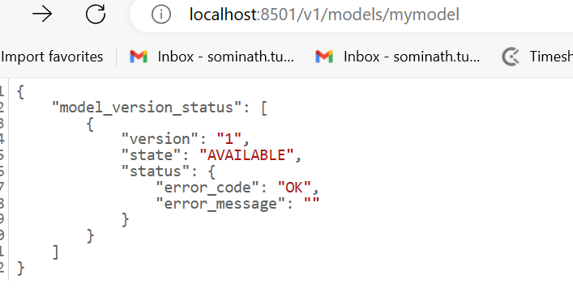
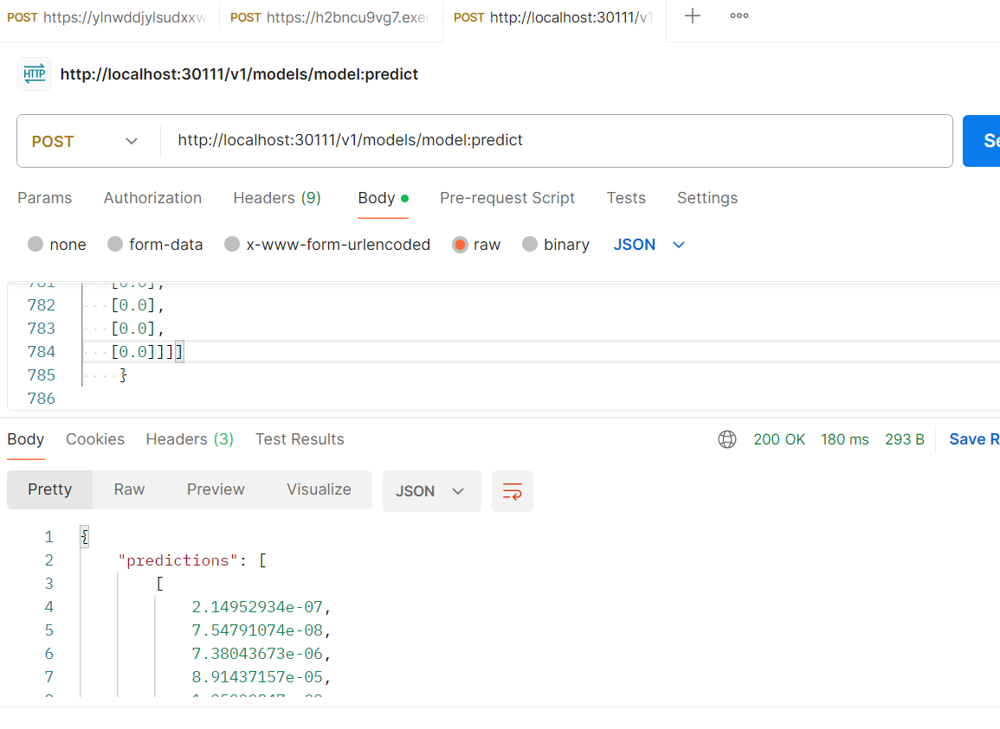

# Used tensorflow sering container 
docker run -d --name serving_base tensorflow/serving

# Copy save model to container 
docker cp ./model serving_base:/models/model

# Commmit changes and set environment
docker commit --change "ENV MODEL_NAME model" serving_base somnathstupe/model-serving

# Get rid of the original TensorFlow Serving image
docker kill serving_base
docker rm serving_base

# Check container working 
docker run -d -p 8501:8501 somnathstupe/mymodel-serving

#  Push docker image to docker hub
docker push my-registry/mymodel-serving

# Create yml file 
kubernetes_manifest.yml

# Deploying the container to Kubernetes
kubectl apply -f kubernetes_manifest.yml

# test deployments in postman 

